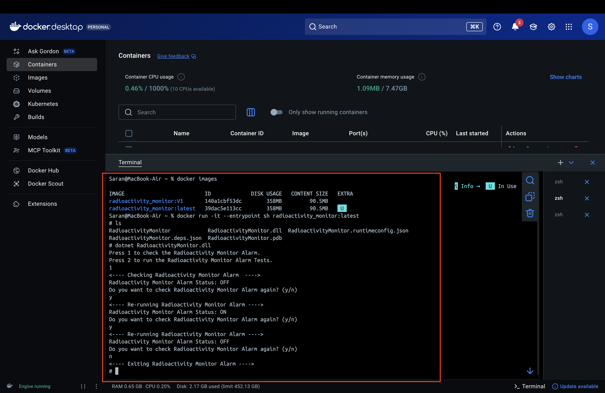
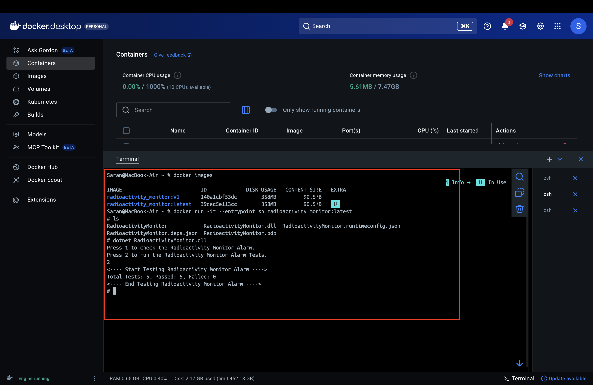

# RadioActivity Monitor
A .NET-based application that monitors radioactivity levels using sensors and automatically triggers alarms when measurements exceed safe thresholds.

## Overview
The RadioActivity Monitor is designed to detect unsafe radioactivity levels in real-time. It uses sensors to continuously measure radiation levels and activates an alarm whenever the readings fall outside the safe operating range (17-21 units).

## System Requirements
- **NET SDK 9.0** or later

## Project Structure
```
RadioactivityMonitor/
├── Program.cs                 # Run the app
│
├─- src/
|   |
|   Contract/                  # Interface definitions
│      ├── IAlarm.cs             # Alarm interface
│      └── ISensor.cs            # Sensor interface
|   |
|   Service/                   # Core implementations
│   ├── Alarm.cs              # Alarm implementation
│   └── Sensor.cs             # Sensor implementation
│
└── tests/
    ├── AlarmTests.cs         # Alarm behavior tests
    ├── AssertionHelper.cs     # Custom assertion utilities
    └── MockSensor.cs         # Mock sensor for testing
```


### Safety Thresholds
| Condition | Threshold       | Alarm State |
| --------- | --------------- | ----------- |
| Below     | < Low Threshold | **ON**      |
| Normal    | Low Threshold ≤ value ≤ High Threshold | **OFF**     |
| Above     | > Threshold     | **ON**      |

### Building the Project
```bash
dotnet build
```

### Running the Application
Run the project with unit tests:
```bash
dotnet run
```
### How to Use  
When you run the application, you'll be presented with a menu:

```
Press 1 to check the Radioactivity Monitor Alarm.
Press 2 to run the Radioactivity Monitor Alarm Tests.
```
#### Option 1: Check the Radioactivity Monitor Alarm
- Select **1** to interactively monitor radioactivity levels
- The application will:
  - Display the alarm status (**ON** or **OFF**)
- After each check, you can:
  - Press **y** to check again
  - Press **n** or any other key to exit

#### Option 2: Run the Radioactivity Monitor Alarm Tests
- Select **2** to run the comprehensive unit test suite
- Tests will display results and confirm all assertions pass

#### Any invalid user selection will exit the Radioactivity Monitor

# Run using docker
## Prerequisite
- **Docker** needs to be installed in the machine where we want to run the app container
## Steps to run the app using docker
1. After installation open **Docker Desktop** in your machine
2. Open terminal in the project root directory. In our case RadioactivityMonitor directory. execute the below command and make sure you can see the **Dockerfile, .csproj and .sln**
```bash
docker build -t radioactivity_monitor:latest .
```
3. once the image is build you can list the image using the belwo command
```bash
docker images
```
4. As this is a console application we need to use the shell of the container to interact with it. To do so execute the below command.
```bash
docker run -it --entrypoint sh radioactivity_monitor:latest
```
5. Once you are in the shell, list the files using "ls" and copy the name of the dll. Then execute the app by using the below command (Replace the dll name if necessary) and use the app following the instructions above.
```bash
dotnet RadioactivityMonitor.dll
```
### Example screenshots


